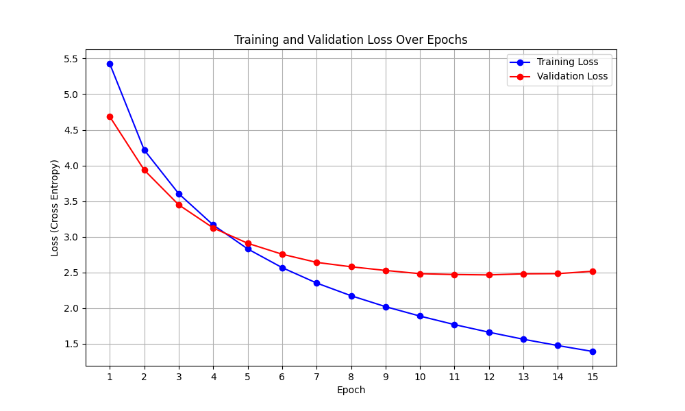

# 从零实现 Transformer (含滑动窗口稀疏注意力)

本项目是为 "Fundamentals and Applications of Large Models"课程实现的中期作业。

本项目从零开始、仅使用 PyTorch 构建了一个完整的 Transformer 编码器-解码器 (Encoder-Decoder) 架构。与标准实现不同，本项目在编码器和解码器中均使用了一种**滑动窗口稀疏注意力** (`ManualSparseAttention`)，以 $O(N \cdot w)$ 的复杂度处理序列，而不是 $O(N^2)$。

模型在 `iwslt2017` (en-de) 数据集上进行了训练和评估，并实现了完整的端到端流程，包括：
* 动态分词器训练 (`tokenizers` 库)
* 模型训练与验证
* 使用 `sacrebleu` 进行 BLEU 分数评估
* 使用 `matplotlib` 绘制损失曲线

## ✨ 主要特性

* **完整架构**: 实现了完整的 `EncoderLayer` 和 `DecoderLayer` 堆栈。
* **稀疏注意力**: 默认使用 `ManualSparseAttention`（滑动窗口注意力）以提高效率。
* **核心组件**: 手动实现了 `Positionembedding` (正弦位置编码)、`PositionWiseFeedForward` 和 `MultiHeadAttention` (作为对照)。
* **端到端流程**: 包含数据加载、分词器训练、模型训练、验证和贪婪解码 (Greedy Decode) `translate` 函数。
* **可复现性**: 提供了完整的依赖文件和运行脚本以重现实验。

## 📂 项目结构

本仓库遵循了作业要求的标准结构：

```
.
├── README.md           # 本文件
├── requirements.txt    # Python 依赖列表
├── scripts/
│   └── run.sh          # 用于复现实验的执行脚本
├── src/
│   └── main.py        # 包含所有模型、训练和评估逻辑的主文件
└── results/
    └── Loss_Curve.png  # 训练后生成的损失曲线图
```

## 🚀 快速开始

### 1. 环境设置

建议使用 `conda` 创建一个隔离的 Python 环境。

```bash
# 1. 克隆仓库
git clone [https://github.com/kafu234/a1](https://github.com/kafu234/a1)
cd a1

# 2. 创建 conda 环境
conda create -n transformer python=3.8
conda activate transformer

# 3. 安装所有依赖
pip install -r requirements.txt
```

### 2. 硬件要求

* **GPU (推荐)**: 强烈建议使用 NVIDIA GPU (8GB+ 显存)。代码会自动检测 CUDA。
* **CPU**: 可以在仅 CPU 环境下运行，但训练过程会极其缓慢。

### 3. 如何运行 (复现实验)

我们提供了一个 `run.sh` 脚本来重现实验。

首先，为脚本添加执行权限：
```bash
chmod +x scripts/run.sh
```

然后，执行脚本开始训练：
```bash
./scripts/run.sh
```

此脚本将执行 `src/train.py`，它会自动完成以下所有操作：
1.  下载 `iwslt2017` 数据集。
2.  在本地训练 `tokenizer_en.json` 和 `tokenizer_de.json` (如果它们不存在)。
3.  使用 `train.py` 中定义的超参数开始 15 个 Epochs 的训练。
4.  训练完成后，在验证集上计算并打印最终的 BLEU 分数。
5. 将训练/验证损失曲线图保存到 `results/loss_curve.png` 。

---
#### (重要) 关于随机种子的说明

为了实现**完全可复现** ，你需要手动在 `src/main.py` 脚本的*最上方*（`import` 语句之后）添加一个固定的随机种子。

```python
# src/train.py (在 import 之后添加)
import torch
import math
import os
# ... 其他 import

# --- 为可复现性添加随机种子 ---
torch.manual_seed(42)
if torch.cuda.is_available():
    torch.cuda.manual_seed_all(42)
# ------------------------------

DEVICE = torch.device(...)
# ... 脚本的其余部分
```
---

## 📊 实验结果

### 训练曲线

训练完成后，损失曲线将自动保存在 `results/Loss_Curve.png`。



### 最终评估 (BLEU Score)

在 15 个 Epochs 训练结束后，模型在 IWSLT 2017 (en-de) 验证集上达到了：

* **最终验证 BLEU 分数**: `20.87`

## 🔧 超参数配置

模型和训练的主要超参数在 `src/train.py` 顶部定义。

| 参数 (Parameter) | 值 (Value) | 描述 |
| :--- | :--- | :--- |
| `D_MODEL` | 512 |嵌入和模型维度 |
| `N_HEADS` | 8 | 注意力头数  |
| `NUM_LAYERS` | 6 |编码器/解码器层数 |
| `D_FF` | 2048 | 前馈网络内部维度|
| `DROPOUT` | 0.1 | Dropout 比例 |
| `MAX_SEQ_LENGTH` | 128 | 最大序列长度 |
| `window_size` | 64 | `ManualSparseAttention` 的窗口半径 |
| `BATCH_SIZE` | 128 | 批次大小 |
| `LEARNING_RATE` | 1e-4 |学习率 |
| `EPOCHS` | 15 | 训练周期 |
